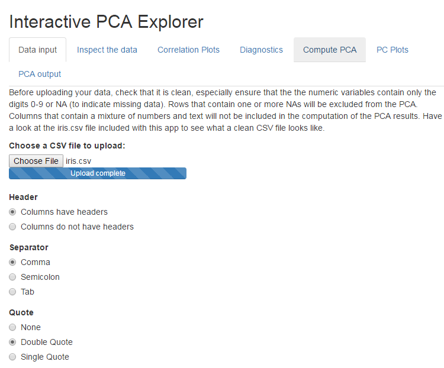
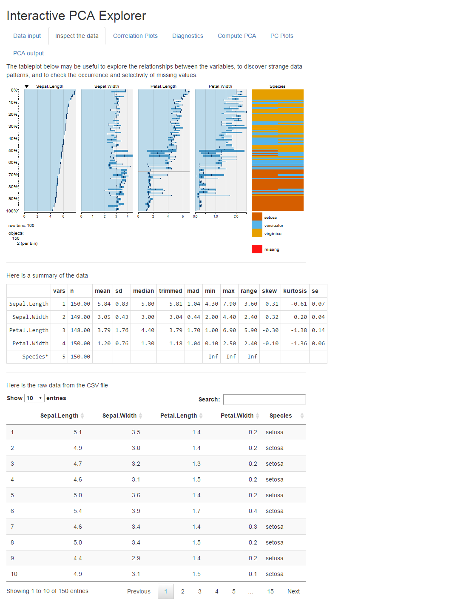
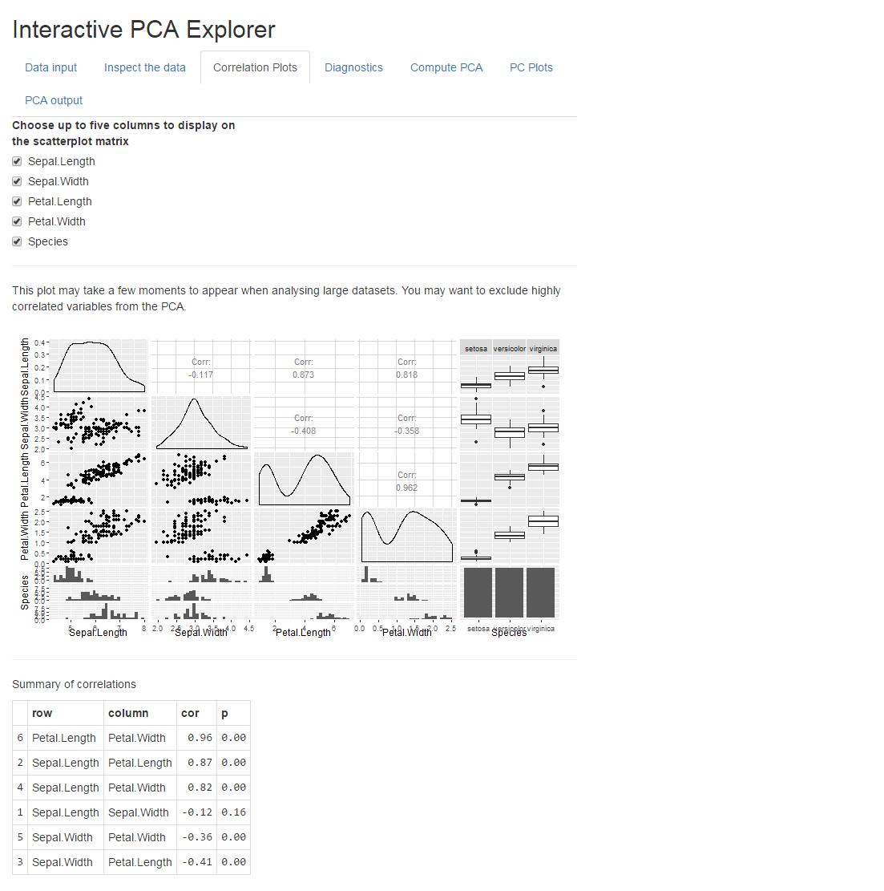
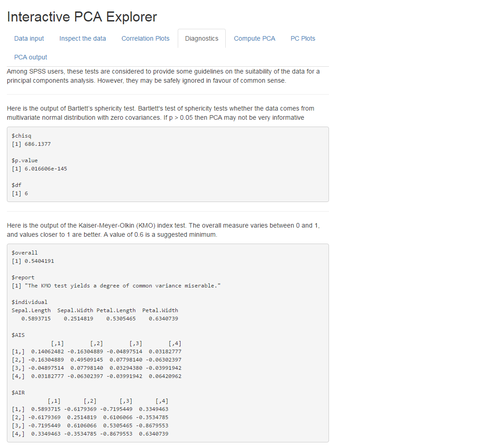
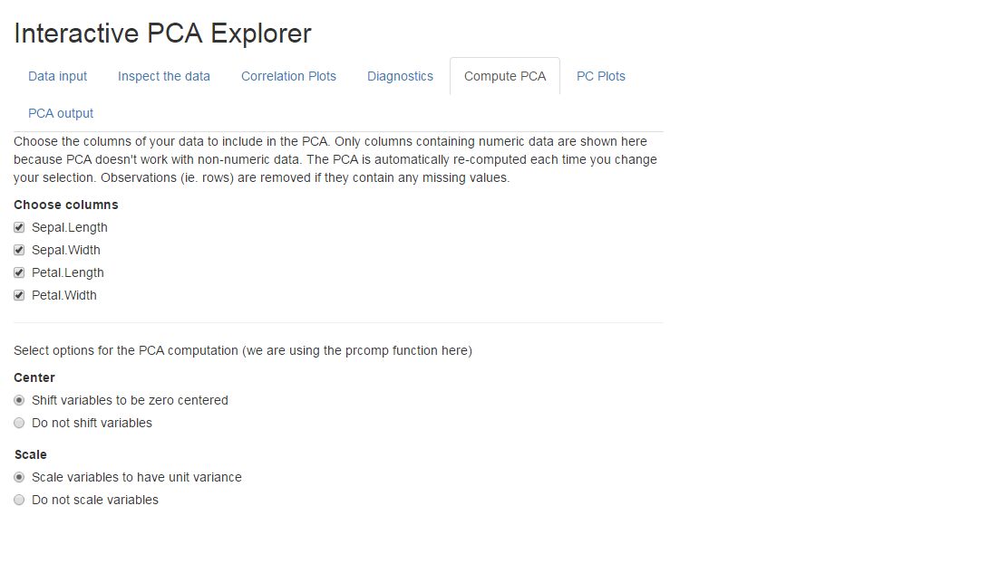
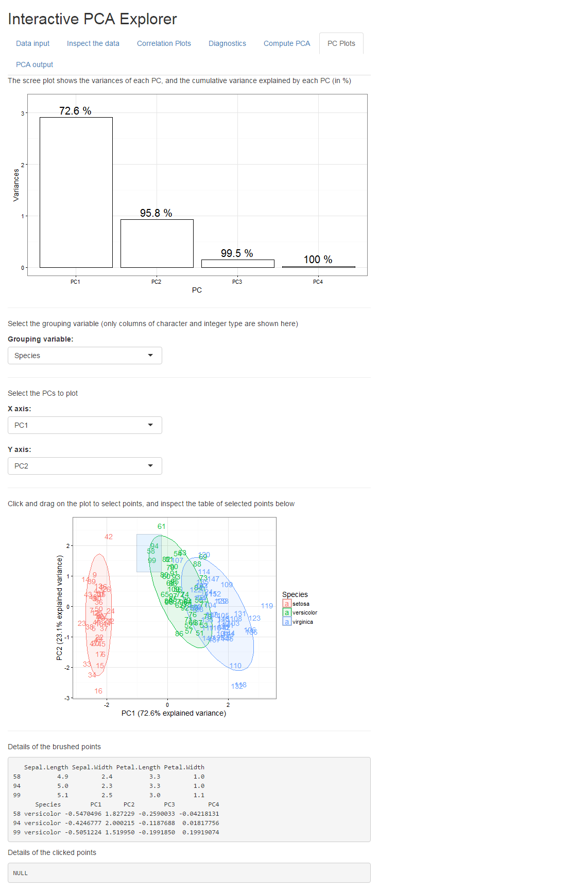
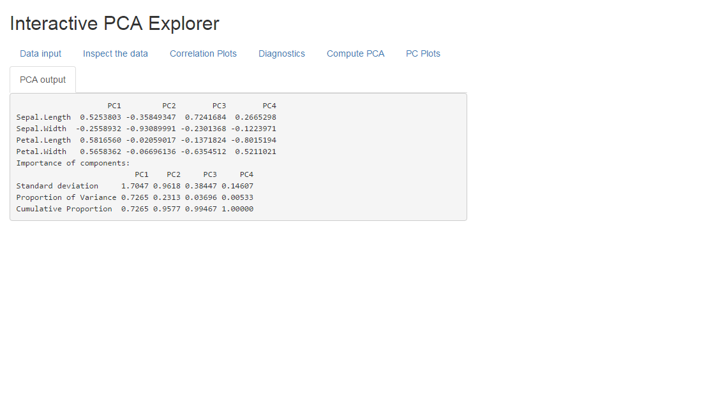

# Interactive PCA Explorer

This [Shiny](http://shiny.rstudio.com/) application takes a CSV file of clean data, allows you to inspect the data and compute a Principal Components Analysis, and will return several diagnostic plots and tables. The plots include a tableplot, a correlation matrix, a scree plot, and a biplot of Principal Components.

You can chose which columns to include in the PCA, and which column to use as a grouping variable. You can choose the center and/or scale the data, or not. You can choose which PCs to include on the biplot.

The biplot of PCs is interactive, so you can click on points or select points and inspect the details of those points in a table. 

## Screenshots

Here's what it looks like. Here we have input a CSV file that contain the [iris data](https://en.wikipedia.org/wiki/Iris_flower_data_set) (included with this app).

   

Then we can see some simple descriptions of the data, and the raw data at the bottom of the page.   

    

Below we see how we can choose the variables to explore in a correlation matrix. We also have a table that summarizes the correlations and gives p-values.  

  

Below we have a few popular diagnostic tests that many people like to do before doing a PCA. They're not very informative and can be skipped, but people coming from SPSS might feel more comfortable if they can see them here also. 

   

Below are the options for computing the PCA. We can choose which columns to include, and a few details about the PCA function. We are using the [prcomp](https://stat.ethz.ch/R-manual/R-devel/library/stats/html/prcomp.html) function to compute the PCA. 

    

Here are the classic PCA plots. First is the scree plot summarizing how important the first few PCs are. Second is the interactive PC biplot. You can see that I've used my mouse to draw a rectangle around a few of the points in the biplot (this is called 'brushing') and in the table below we can see the details of those points in the selected area. We can choose which column to use for grouping (this only affects the colouring of the plot, it doesn't change the PCA results), and we can choose which PCs to show on the plot. 

Finally we have some of the raw output from the PCA.

